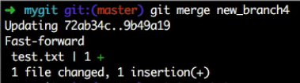
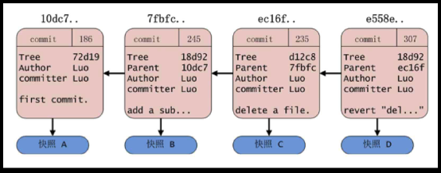
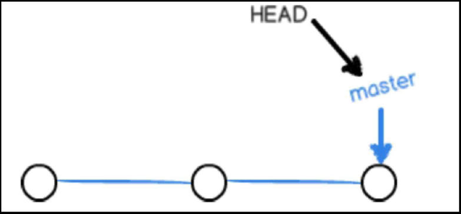
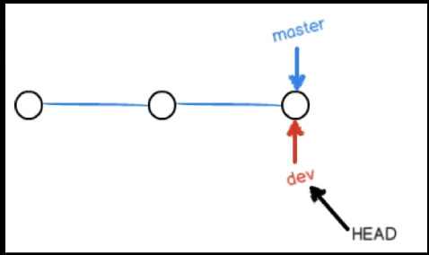
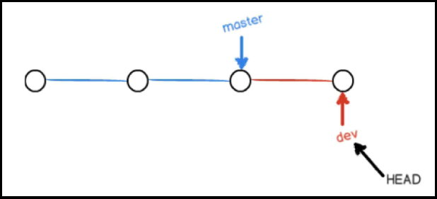
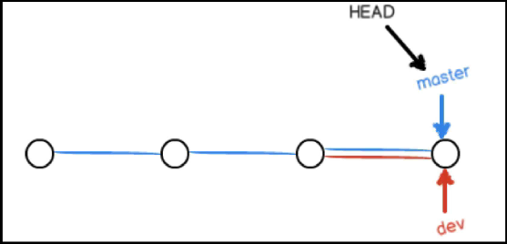
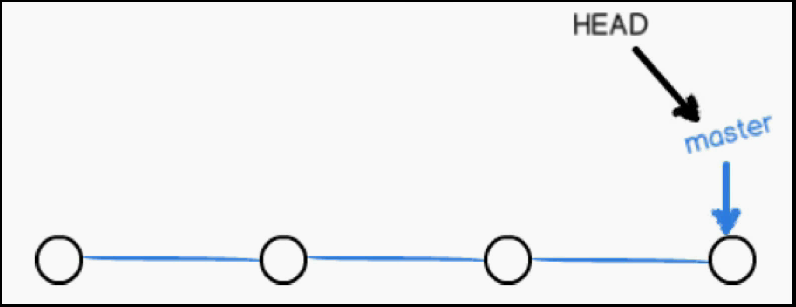
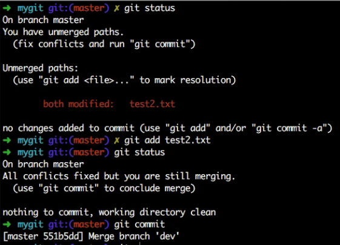
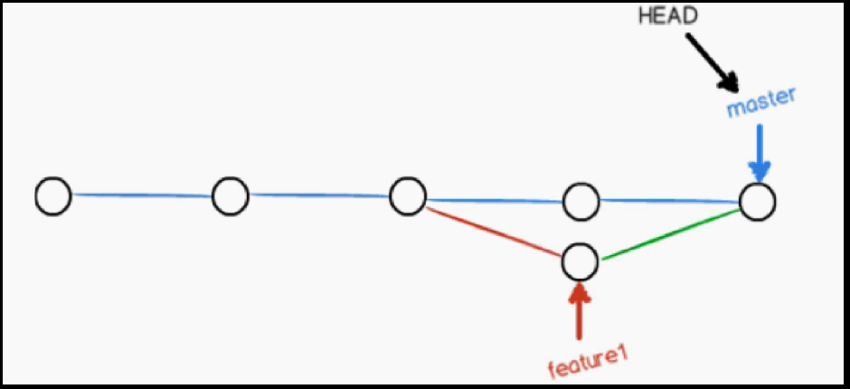

#### 忽略文件 &emsp;&emsp;.gitignore
* 作用：忽略工作区中的相关文件，使之不被git所识别，并且不被git所追踪，当然不被git纳入到版本控制系统当中去
* `.gitignore`此文件建项目时放在项目的根目录下，第一级目录下
  * *.a&emsp;&emsp;&emsp;&emsp;&emsp; # 忽略所有.a结尾的文件
  * !lib.a&emsp;&emsp;&emsp;&emsp;&emsp; # 但lib.a除外
  * /TODO&emsp;&emsp;&emsp;&emsp;&emsp; # 仅仅忽略项目根目录下的TODO文件，不包括subdir/TODO
  * build/&emsp;&emsp;&emsp;&emsp;&emsp;# 忽略build/目录下的所有文件
  * doc/*.txt&emsp;&emsp;&emsp;&emsp;&emsp;# 会忽略doc/note.txt但不包括doc/server/arch.txt

**新建目录并进入该目录的命令：mkdir mydir && cd mydir**
#### 分支
* `git init`之后git会生成一个master分支，这个是git的主分支，默认项目一开始在master分支上
* `git branch`显示当前所有的分支列表，前面带有*号的分支表示当前处于该分支下
 * `git branch branchName`表示创建一个新的分支
 * `git checkout branchName` 表示从当前分支切换到一个新的分支上
#### 分支重要操作
* `git branch -d branchName` 或`git branch -D branchName` 表示删除一个名字为branchName的分支，`-d` 在删除分支时，如果待删除的分支有改动，且改动没有合并到其他分支上，则会报错，`-D` 表示无论待删除的分支是否有改动或改动是否被合并到其他分支，此命令都可以删除成功（注：不能删除当前所处的分支）
 * `git checkout -b new_branch` 表示创建一个名字为new_branch的分支，并且切换到新建分支上
* `git merge new_branch` 表示将new_branch分支上的修改合并到当前所处的分支上，比如当前所处的分支为master，则`git merge new_branch`表示将new_branch分支上的修改合并到master分支上

* `git branch -v` 表示显示当前所处分支提交的最近或者最新的一次消息，包括commit id跟commit message这两个重要的信息
### 分支概念
* 一个commit对象链：一条工作记录线

* HEAD指向的是当前分支
* master指向提交

* 红色dev表示在master分支上调用`git branch`，在master基准上创建一个dev名字的分支，git创建分支是非常轻量级的，如果在master上创建了dev分支，实际上文件的信息是一点都没有变化的，文件是没有任何变化的，相当于只是创建了一个指针，指针的名字叫dev，它在当前时刻与master指向同一个提交，HEAD指向dev，表示当前分支已经由master切换到了dev，master与dev这种分支的名字指向的是提交，而HEAD指向的是当前的分支，当前在哪个分支上，HEAD就指向哪，HEAD内容保存在`.git/HEAD`下，内容为`ref: refs/heads/master`（当前分支为master）

* 在dev分支上又做了一次提交，而且dev指向当前的提交，master指向第三次提交，而dev指向第四次提交，而HEAD永远指向当前的分支

* 将dev分支上的内容合并到master上了，master分支从指向第三次提交变成了指向第四次提交，这样的话合并就完成了，这种合并叫快进，fast-forward，没有任何冲突，直接就可以合并

* 分支合并冲突，master分支上进行修改后提交，master向前前进了一个提交，dev分支上对同一地方进行修改后提交，dev也向前前进了一个提交，此时将dev合并到master上会`CONFLICT`报错，手动解决冲突并提交

### fast-forward
* 如果可能，合并分支时Git会使用fast-forward模式
* 在这种模式下，删除分支时会丢掉分支信息
* 合并时加上--no-ff参数会禁用fast-forward，这样会多出一个commit id
  * git merge --no-ff dev
* 查看log
  * git log --graph
### Git回退版本
* 回退到上一版本
    * git reset --hard HEAD^
    * git reset --hard HEAD~1
    * git reset --hard commit_id
* 返回到某一个版本
    * git reflog&emsp;&emsp;记录的是操作日志，而log记录的只是提交日志