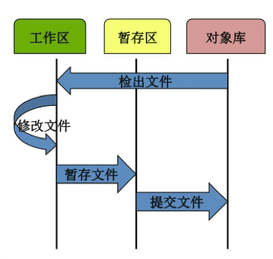
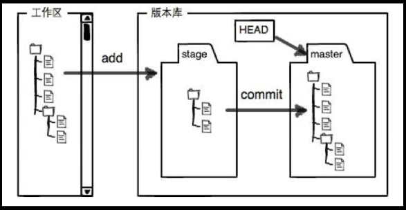
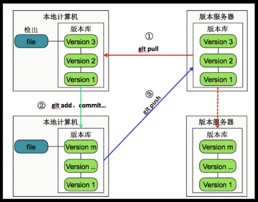
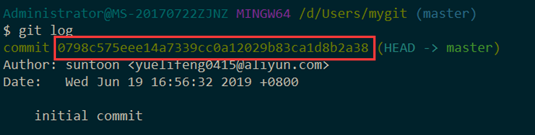
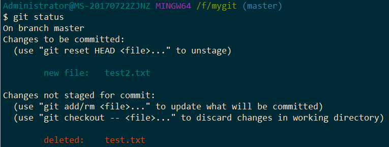

#### Git、GitHub与GitLab
* Git是一个版本控制软件
* GitHub与GitLab都是用于管理版本的服务端软件
* GitHub提供免费服务（代码需公开）及付费服务（代码为私有）
* GitLab用于在企业内部部署Git版本库，功能类似于GitHub
#### Git维护的文件在某一特定时刻只能处于三种状态
* 已修改（modified）
* 已暂存（staged）
* 已提交（committed）
#### Git文件状态
* Git文件
  * 已被版本库管理的文件
* 已修改
  * 在工作目录修改Git文件
* 已暂存
  * 对已修改的文件执行Git暂存操作，将文件存入暂存区
* 已提交
    * 将已暂存的文件执行Git提交操作，将文件存入版本库

#### 本地版本库与服务器版本库

#### Git常用命令
* 获得版本库
  * git init
  * git clone
* 查看信息
  * git help
  * git log
  * git diff
* 版本管理
  * git add
  * git commit
  * git rm
* 远程协作
  * git pull
  * git push
#### 命令详解
* `git init` 用于初始化一个空的仓库，在仓库下面的一切操作都会纳入到git的版本控制当中
* `git clone` 将远程版本库项目复制一份到本地
* `git add` 将当前已修改的文件纳入到暂存区当中
* `git commit` 将暂存区当中的文件提交到git的版本库当中
* `git rm` 删除版本库中的特定的文件
* `git help` 获取git的帮助信息
* `git log` 查看git的操作日志，非常重要的命令
* `git diff` 比较文件在不同状态下的差别，比如比较已修改与暂存区之间的差别，也可以比较暂存区与已提交或者说是跟版本库之间的差别
* `git pull` 从远程版本库当中将文件拉取到本地
* `git push` 将本地版本库信息或者内容推送到远程版本库
* `git status` 查看当前版本库状态，非常重要的命令，经常使用
#### Git的提交id（ commit id ）是一个摘要值，这个摘要值实际上是一个sha1计算出来的

#### 对于user.name与user.email来说，有3个地方可以设置：
1. 整个计算机电脑设置（几乎不用），`git config --system`
2. 用户的主目录（很常用），`git config --global`
3. 针对于特定项目的，在`.git/config`文件中，`git config --local`
`git config --global user.name 'xxx'`
`git coffig --global user.email 'xxx'`
#### `git rm`说明：
1. 删除一个文件
2. 将被删除的文件纳入到暂存区
#### 若想恢复被删除后的文件，需要进行两个动作：
* `git reset HEAD test2.txt`，将待删除的文件从暂存区恢复到工作区
* `git checkout -- test2.txt`，将工作区的修改丢弃掉
#### `rm`说明：
将文件删除掉了，这是被删除的文件并未纳入到暂存区当中，如果此时直接commit提交，是提交不了的，得先用`add`纳入到暂存区，之后使用以上两个命令恢复。
#### `git`提供对`commit`后文件的重命名命令：
`git mv sourceFile destinationFile`，比如：`git mv test.txt test2.txt`
想从暂存区恢复到工作区可以使用：
`git reset HEAD test.txt`之后`git status`

可以看出，`git`重命名做了两件事情，新建有相同内容的新文件并删除源文件
##### `git mv`与`mv`的关系相当于`git rm`与`rm`的关系，`git mv`重命名后纳入暂存区，`mv`只是重命名
`git commit --amend -m 'xxx'`表示把上次提交的git message修改成xxx
#### 查看git历史，`git log`，可以填写参数：
* -p展开显示每次提交的内容的差异
* -n 仅显示最近的n次更新
* --start 仅显示简要的增改行数统计
* --pretty=online 以简单的形式展示提交信息，左侧展示的是commit id，右侧展示的是提交的message
* --pretty=format:"%h - %an, %ar : %s"，按照定制的格式显示
#### 获取Git config帮助
* git help config
* git config --help
* man git-config