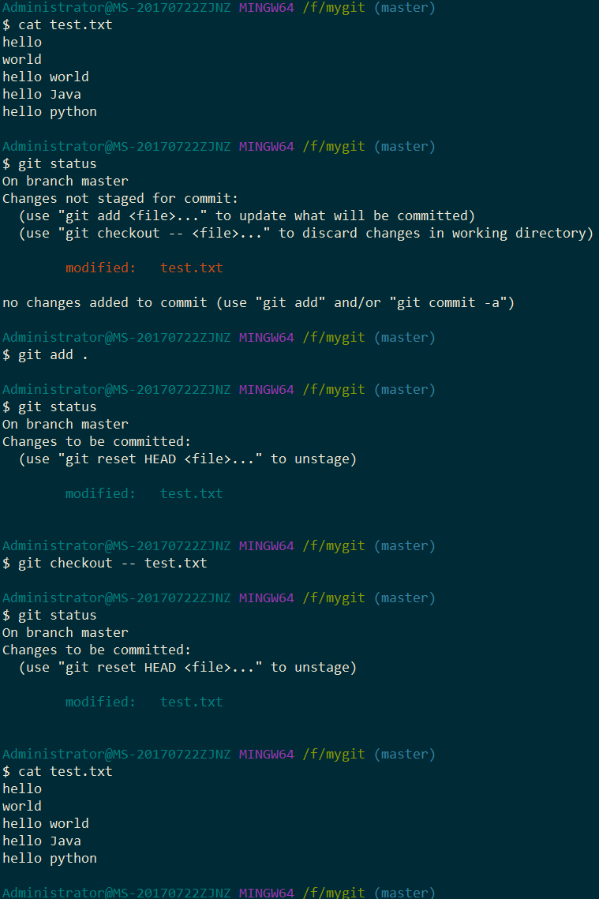

##### **`git checkout -- fileNmae`作用：丢弃掉相对于暂存区中最后一次添加的文件内容所做的变更**

##### **修改之后如果将修改的内容提交到暂存区，则不能使用`git checkout -- fileName`丢弃变更**

**`git reset HEAD fileNmae`作用：将之前添加到暂存区（stage，index）的内容从暂存区移除到工作区**
**`git reset HEAD fileName`将提交到暂存区的变更从暂存区中移出，此时可以使用`git checkout -- fileName`丢弃变更**

##### `git stash`将当前在分支上一切的修改状态临时保存起来，在未来的某一时刻就可以恢复出来，`git stash list`将当前所有的保存状态列出来，`git stash pop`将最新的一次保存状态恢复出来，同时将保存的临时状态给删除掉，`git stash apply`将之前保存的状态恢复过来，但是不删除stash保存的临时状态
### 保存现场工作
* 保存现场
    * `git stash`
    * `git stash list`
* 恢复现场
    * `git stash apply` （stash内容并不删除，需要通过git stash drop stash@{0}手动删除）
    * `git stash pop` （恢复的同时也将stash内容删除）
    * `git stash apply stash@{0}`