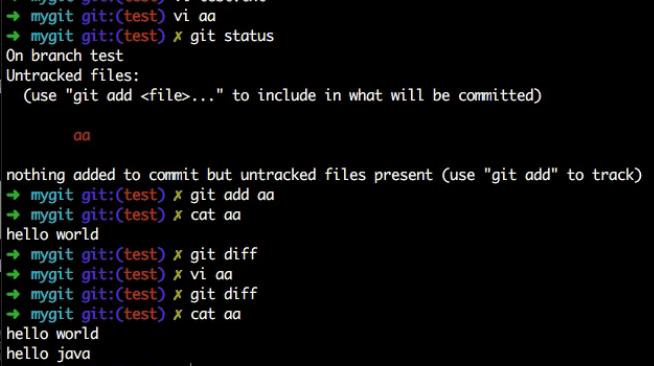
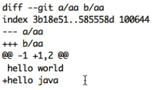

### Git标签
* 新建标签，标签有两种：轻量级标签（lightweight）与带有附注标签（annotated）
* 创建一个轻量级标签
  * `git tag v1.0.1`
* 创建一个带有附注的标签
  * `git tag -a v1.0.2 -m 'release version'`
* 删除标签
  * `git tag -d tag_name`
* 查看标签
  * `git tag`
* 查找标签
  * `git tag -l 'v1.0'`表示查找名为v1.0的标签
  * `git tag -l 'v*'`表示查找名为v开头的标签

`git blame fileName` 显示上一次修改文件的作者以及修改的内容
### diff
* `git diff`：比较的是暂存区与工作区文件之间的差别。原始文件为暂存区文件，目标文件为工作区文件。工作区创建内容为hello world的文件aa，然后将aa纳入到暂存区，此时进行`git diff`进行暂存区与工作区文件差异比较，比较结果为空，表示没差异，之后编辑工作区文件aa，增减一行内容hello java，之后进行`git diff`命令，比较结果如下图，比较结果表示原文件（暂存区）文件增加一行hello java即变成目标文件（工作区）文件。

* `git diff commit_id`：表示比较特定提交（原始文件）与工作区文件（目标文件）的差异，如果与当前最新提交比较，可用`git diff HEAD`命令。
* `git diff --cached commit_id`：表示比较某个特定提交与暂存区之间文件的差异。`git diff --cached`表示最新提交与暂存区之间的差异。