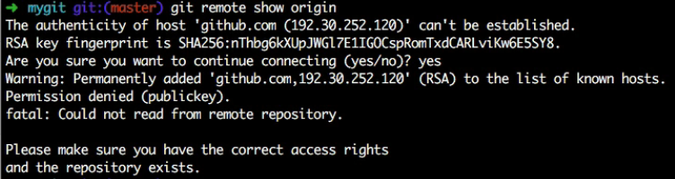
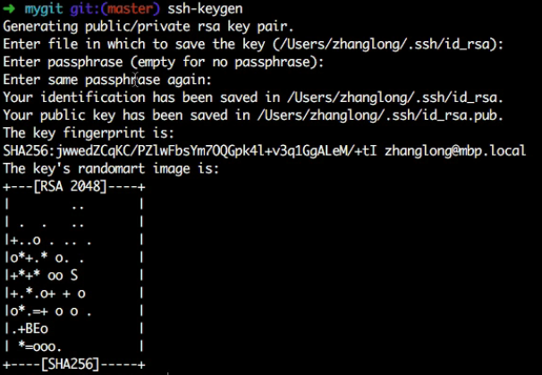
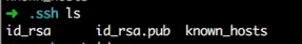
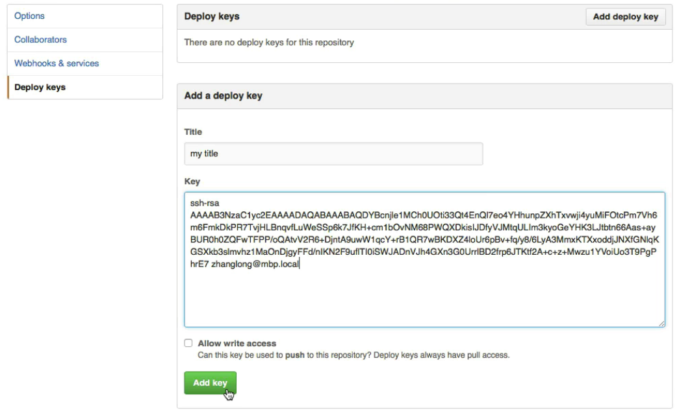
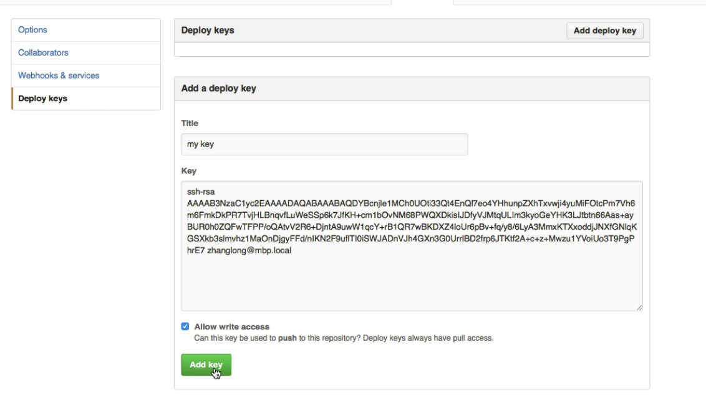
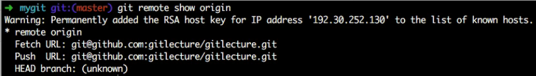
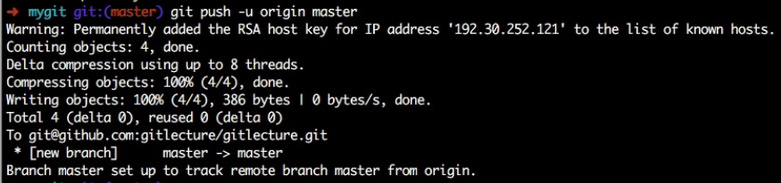
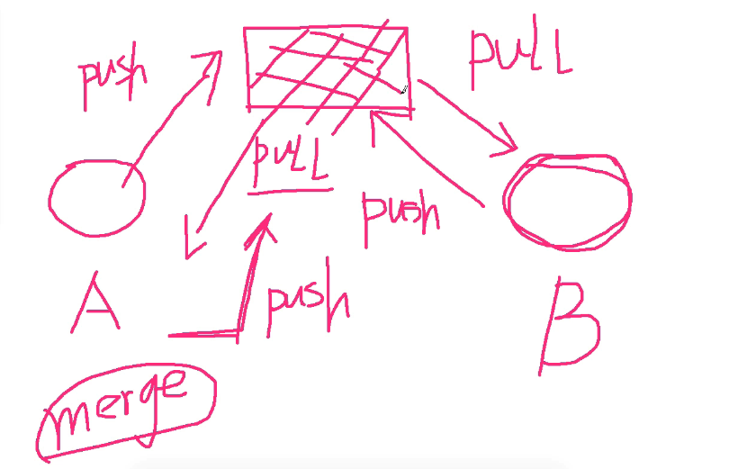

* `git push`
* `git pull`相当于`fetch` + `merge`
* `git remove add origin https_url`添加地址为https_url别名为origin的远程仓库
* `git push -u origin master`将本地master与origin的master关联起来
* `git remote show`列出与当前项目相关的所有远程仓库的别名
* `git remote show origin`列出跟origin远程仓库相关的详细信息
#### SSH关联远程仓库（针对仓库级别设置公钥信息）
* `git init`初始化本地仓库
* `git config --global user.name 'xxx'`
* `git config --global user.email 'xxx'`
* `git add .`
* `git commit -m 'firset commit'`
* `git remote add origin 'ssh.git'`添加ssh地址的远程仓库
* `git remote show origin`

* `ssh-keygen`生成公钥和秘钥，在windows下使用putty工具生成

* 将公钥id_rsa.pub的内容放到github上

* `git remote show origin`

* `git push -u origin master`

#### 开发流程分支使用约定
1. Gitflow
2. 基于Git分支的开发模型：
   * develop分支，项目日常开发供开发人员之间使用，频繁变化的分支
   * test分支，供测试与产品等人员使用的分支，变化不是特别频繁，由develop分支merge过来的
   * master分支，生产发布分支，变化非常不频繁的一个分支，由test分支merge过来的
   * bugfix（hotfix）分支，生产系统当中出现了紧急bug，用于紧急bug修复的分支。
#### Git协作
* 协作方式，svn类似方式
